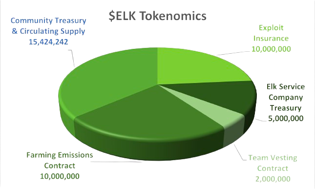

# ELK Token

## ELK

ELK is a utility token built for cross-chain value transfer. As an ERC20 token, ELK is freely tradeable on exchanges and fully compatible with compatible wallets on supported chains. ELK will eventually be available on non-EVM chains.

## ELK Token Distribution 

ELK has been allocated to fixed Reservoir contract addresses on every chain except Avalanche, which will serve as the governance chain. On the governance chain (Avalanche), ELK is allocated to the following contracts and in the following amounts:

* 10M ELK: allocated to an **Exploit Insurance** contract
* 5M ELK: allocated to an **Elk Service Company Treasury** contract
* 2M ELK: allocated to a **Team Vesting** contract
* 10M ELK: allocated to a **Farming Emissions Contract** contract
* The remaining ELK is split between the circulating supply and the **Community Treasury** contract

<figure><figcaption></figcaption></figure>

## Exploit Insurance Contract 

This contract stores **10M $ELK** to be used for insurance against any unforeseen exploits of the ElkNet. It is subject to Elk governance. The proposed reserve is equivalent to more than 3 days of transfers based on current daily ElkNet transfers limits per chain (this assumes that a malicious exploit would be discovered within three days).

In the event of a double-spend attack, ELK will be burned from this fund to ensure that the circulation of ELK never reaches more than 42M. In the event of attacks involving other tokens interacting with ElkNet, these funds can cover the losses incurred by third parties.

## Elk Service Company Treasury 

This treasury contract is controlled by the Elk Service Company multi-sig. The contract releases a maximum of 10k ELK per week up to a total of **5M ELK**. These funds are intended to cover the development and operating expenses of the Elk Service Company in promoting the growth of Elk. Claims will not begin until the Elk Service Company becomes an incorporated entity.

## Team Vesting Contract 

This contract releases a maximum of 1k ELK per day up to a maximum of **2M ELK**. These funds can be claimed without restriction by the developers, per the original litepaper, and are used for team compensation and regular operating expenses. Neither the Elk Service Company nor the Elk governance has oversight over the use of the funds.

## Farming Emissions Contract 

A unified contract storing emissions reserves until farming ends. This contract holds the emissions to be released according to the determined schedule. The team maintains responsibility for allocating emissions to the farms in the best interest of the project until the establishment of a full fledged governance body.

## Community Treasury 

The Community Treasury will be controlled by Elk governance. The contract will place a hard cap of **2M ELK** to be spent by governance per year on proposals achieving a simple voting majority once governance is fully implemented.

## Token Details

* **Ticker**: ELK
* **Maximum Supply**: 42,424,242 ELK
* **ELK Token Contract:** 0xeEeEEb57642040bE42185f49C52F7E9B38f8eeeE


The ELK token has the same contract on each EVM chain. It is native to each chain it is own!


* ELK token blockchain explorer Links:&#x20;
  * \[[Avalanche](https://snowscan.xyz/token/0xeeeeeb57642040be42185f49c52f7e9b38f8eeee)] \[[Polygon](https://polygonscan.com/token/0xeEeEEb57642040bE42185f49C52F7E9B38f8eeeE)] \[[Fantom](https://ftmscan.com/token/0xeEeEEb57642040bE42185f49C52F7E9B38f8eeeE)] \[[Huobi ECO](https://hecoinfo.com/token/0xeEeEEb57642040bE42185f49C52F7E9B38f8eeeE)] \[[Gnosis (formerly xDAI)](https://blockscout.com/xdai/mainnet/token/0xeEeEEb57642040bE42185f49C52F7E9B38f8eeeE/token-transfers)] \[[BNB Chain](https://bscscan.com/token/0xeEeEEb57642040bE42185f49C52F7E9B38f8eeeE)] \[[Kucoin](https://explorer.kcc.io/en/token/0xeeeeeb57642040be42185f49c52f7e9b38f8eeee)] \[[Harmony](https://explorer.harmony.one/address/0xeEeEEb57642040bE42185f49C52F7E9B38f8eeeE)] \[[OEC](https://www.oklink.com/en/okc/address/0xeeeeeb57642040be42185f49c52f7e9b38f8eeee)] \[[HOO](https://hooscan.com/token/0xeEeEEb57642040bE42185f49C52F7E9B38f8eeeE)] \[[Elastos](https://esc.elastos.io/token/0xeEeEEb57642040bE42185f49C52F7E9B38f8eeeE/token-transfers)] \[[Moonriver](https://blockscout.moonriver.moonbeam.network/token/0xeEeEEb57642040bE42185f49C52F7E9B38f8eeeE/token-transfers)] \[[Cronos](https://cronos.org/explorer/token/0xeEeEEb57642040bE42185f49C52F7E9B38f8eeeE/token-transfers)] \[[Telos](https://www.teloscan.io/address/0xeeeeeb57642040be42185f49c52f7e9b38f8eeee)] \[[Fuse](https://explorer.fuse.io/token/0xeEeEEb57642040bE42185f49C52F7E9B38f8eeeE/token-transfers)] \[[IoTeX](https://iotexscout.io/address/0xeEeEEb57642040bE42185f49C52F7E9B38f8eeeE)]
* **Token Type**: ERC-20 (supported chains) / native currency (Elk mainnet)
* **Supported Blockchains:**

| EVM compatible                                                                                                                                                                                                                                                                                                                                                                                                                                                                                                                                                                                                                                                                                                                                                                                                                                                                                                                                                                                                                                                                                                                                                                                                                                                                                                                                                 |                                                                                                                                                                                                                                                                                                                                                                                                                                                                                                                                                                                                                                                                                                                                                                                                                                                                                                                                                                                                                                                                                                                                                                                                                                                                                                      |                                                                                                                                                                                                                                                                                                                                                                                                                                                                                                                                                                                                                                                                                                                                                                                                                                                                                                                                                                                                                                                                                                                                                                                                                                                                                                                                  |
| -------------------------------------------------------------------------------------------------------------------------------------------------------------------------------------------------------------------------------------------------------------------------------------------------------------------------------------------------------------------------------------------------------------------------------------------------------------------------------------------------------------------------------------------------------------------------------------------------------------------------------------------------------------------------------------------------------------------------------------------------------------------------------------------------------------------------------------------------------------------------------------------------------------------------------------------------------------------------------------------------------------------------------------------------------------------------------------------------------------------------------------------------------------------------------------------------------------------------------------------------------------------------------------------------------------------------------------------------------------- | ---------------------------------------------------------------------------------------------------------------------------------------------------------------------------------------------------------------------------------------------------------------------------------------------------------------------------------------------------------------------------------------------------------------------------------------------------------------------------------------------------------------------------------------------------------------------------------------------------------------------------------------------------------------------------------------------------------------------------------------------------------------------------------------------------------------------------------------------------------------------------------------------------------------------------------------------------------------------------------------------------------------------------------------------------------------------------------------------------------------------------------------------------------------------------------------------------------------------------------------------------------------------------------------------------- | -------------------------------------------------------------------------------------------------------------------------------------------------------------------------------------------------------------------------------------------------------------------------------------------------------------------------------------------------------------------------------------------------------------------------------------------------------------------------------------------------------------------------------------------------------------------------------------------------------------------------------------------------------------------------------------------------------------------------------------------------------------------------------------------------------------------------------------------------------------------------------------------------------------------------------------------------------------------------------------------------------------------------------------------------------------------------------------------------------------------------------------------------------------------------------------------------------------------------------------------------------------------------------------------------------------------------------- |
| 
Astar

Arbitrum

Avalanche

Base

BNB Chain

Bitgert

BitTorrent

Cronos

Ethereum

Elastos
 | 
Fantom

Fuse

Gnosis

Harmony

HSC

HECO

IoTeX

Kava

KCC

Linea
 | 
Moonriver

Neon

Metis

OKC

Optimism

Polygon

Telos

Velas

Wanchain

Q
 |
