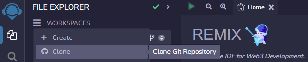

# Deploy a Bridge with BaaS (Alpha)

Here’s a step-by-step guide for launching your own Reservoir style bridge using ElkNet’s BaaS. This means that the deployed bridge will use a reservoir type system, just like the ELK token. We will use the Avalanche C-Chain and Polygon Chain Mainnets in this guide. Feel free to use any of the chains listed below, however. If you would like all contract addresses to be the same on multiple chains, it is very advisable to use a fresh wallet/address and do the same amount of transactions in the same order on all blockchains so the nonces stay the same. It is recommended that you set up your bridge on testnets first if you are concerned about gas.

Currently, BaaS is available on the following testnets:

* Avalanche Fuji
* Polygon Mumbai
* Fantom Testnet
* Optimism Testnet
* Ethereum Goerli

BaaS Contract Addresses on Testnets above:

* BaasConfig: 0x58986C808Bd0B904B60ADFcdD29586833Db6C0b9
* Bifrost: 0x59f607fe24Dc6E4e154067Cb5768cE2f6cdb2d63
* ElkNet: 0x9603D57C5D7c21cf61A5591cEbeA2B43489B15cD

BaaS is available on the following mainnets:

* Avalanche
* Polygon
* Binance Smart Chain
* Linea
* Q (Coming Soon)

Contract Addresses on Mainnets above:

* BaasConfig: 0x87187D96Bf51e9FB577e804BCE5747d7a81486C9
* Bifrost: 0x153eE9BD2F69A0037e75b30e34be5E86Fb1E693a
* ElkNet: 0xD30Ffa3821F41A17Cb1850188C235703A73E4753

1. **Sign up for an ElkNet BaaS Realm** here: [https://forms.gle/vYHUd5CoZrbiGZut7](https://forms.gle/vYHUd5CoZrbiGZut7) and wait for the approval message in your Telegram DM from @LtSnakePlissken or @Baal314. Note your Realm ID number.
2. **Open Remix and Clone the Repo**- Navigate to [https://remix.ethereum.org/](https://remix.ethereum.org/) and clone the following Git Repo: [https://github.com/LtSnakePlissken/baas](https://github.com/LtSnakePlissken/baas)\
   \
   
3. **Deploy your Token** (Optional)- Navigate to contracts/examples/ERC20Example.sol in Remix, change the token name, symbol, decimals, and total supply if desired. Compile with Solidity version 0.8.19 (may work with later/earlier versions) and 1,000,000 optimizations. After compiling, navigate to the "Deploy & Run Transactions" tab in Remix, ensure "Injected Provider" is selected and that the correct wallet address is displayed, and click "Deploy" and confirm the transaction in your wallet to deploy your token on Avalanche C Chain. Switch your wallet to the Polygon Chain and click "Deploy" again to ensure your token is deployed on both chains. You can repeat this step for as many BaaS supported chains as you'd like. Save your token's contract address. Feel free to compile and deploy your own ERC-20 token or utilize your pre-existing token as well.

<figure><figcaption>
Feel free to change the token's name, symbol, decimal, and supply.
</figcaption></figure>

 

<figure><figcaption>
Compile your ERC-20 Contract
</figcaption></figure>

 

<figure><figcaption>
Deploy your token
</figcaption></figure>

4. **Deploy the Reservoir**- Now that your token is deployed on Polygon and Avalanche, it's time to deploy the Reservoir Contract. In Remix navigate to contracts/examples/ElkReservoirExample.sol, rename ElkReservoirExample in the contract line to something more relevant, compile the contract with Solidity 0.8.19 and 1,000,000 optimizations, and head to the deploy tab. In order to deploy your Reservior, expand the "Deploy" section, input the contract address of your token on the chain you are deploying on for TOKENADDRESS (if you've been following this guide, your contract addresses should be the same on both chains) and a max token limit per transfer in TXLIMIT before pressing "transact" to deploy the contract. Remember to record the contract address for the Reservoir!\
   \
   Note that TXLIMIT takes a uint256 value, meaning that if you deployed a token with 18 decimals and you wanted a max limit of 100 tokens per transfer, you'd have to input 100000000000000000000 (100 with 18 zeros). Note that all deployed contracts will appear in the bottom left side of the "Deploy & Run Transactions" window and you can interact with them using the connected wallet.

<figure><figcaption>
Renaming ElkReservoirExample to something more relevant
</figcaption></figure>

 

<figure><figcaption>
Deploy your Reservoir on all chains
</figcaption></figure>

5. **Fund the Reservoir Contract(s)**- Only on Polygon (or if launching on more than 2 chains, do this on all but a single chain) send all tokens to the Reservoir address you created by importing the token you've created into MetaMask, clicking send, and inputting your Reservoir address as the receiver. This will ensure that the Reservoir can send users tokens on Polygon from the Reservoir after bridging from Avalanche. BaaS is also capable of many different bridging methods, but we will be utilizing the Reservoir type in this guide.\
   \
   In order to keep the nonces, and therefore your contract addreses the same on all chains, it is advisable to send your tokens to an alternate address on Avalanche, this also makes it easier to test the bridge as a user without utilizing nonces.
6.  **Deploy the Realm**- Navigate to contracts/examples/ElkRealmExample.sol and change the name of the contract as desired (same as step 4). Compile again with Solidity 0.8.19 and 1,000,000 optimizations. Navigate to the "Deploy & Run Transactions" tab, expand the "deploy" section, input your Reservoir contract address from step 4 in RESERVOIR, the BiFrost address from the start of this guide in the BIFROST field, and "1" in the ENABLED field (you can also put 0 if you do not want to enable the bridge immediately). Click "transact" and repeat this step on the other chain. Record the Realm contract address.

    <figure><figcaption>
Deploying the Realm
</figcaption></figure>
7.  **Deploy Bridge Head Contract**- Navigate to contracts/examples/BridgeHeadExample.sol and change the name of the contract as desired (same as steps 4 and 6), compile the contract with the same settings as the others, and deploy the contract on each chain with:\
    \
    \-REALMID: The Realm ID provided to you by @LtSnakePlissken or @Baal314 in Telegram\
    \-BIFROST: The BiFrost contract address listed at the top of this guide\
    \-RESERVOIR: The contract address of the Reservoir you previously deployed

    <figure><figcaption>
Enter the info and hit "transact". Remember to record the contract address of your Realm.
</figcaption></figure>
8.  **Enable Transfer to Other Chains**- Expand the Realm contract in the "Deploy & Run Transactions" window, expand "setTargetChainSupported", and enter the ChainID of the chains users can bridge to and set "\_supported" to "1" (for true) and click "transact".\
    \
    For example, since we're currently connected to Avalanche, we would put "137" in "chainId" to enable transfers to Polygon on Avalanche, and then when switching our network to Polygon, we would input "43114" in "chainId" to enable transfers to Avalanche from Polygon.\
    \
    Testnet Chain IDs: Goerli (ETH)- 5, Optimism Goerli- 420, Fantom Testnet- 250, Avalanche Fuji- 43113, Polygon Mumbai- 80001

    <figure><figcaption>
If we were launching this on more than 2 chains, we would input all other chain ID's, one at a time, except for the chain we're currencly connected to.
</figcaption></figure>
9.  **Set the BiFrost Address in Your Realm**- Scroll down to the "BIFROST\_ROLE" button in the Realm contract and click it to reveal the name of the role (in bytes32). Copy that data without quotes, scroll up and expand the "grantRole" function, and paste it into the "role" field. Input the BiFrost address at the start of this guide into the "account" field, and press "transact". Repeat this on all chains. Check that the "BIFROST\_ROLE" outputs the same data on every chain by clicking it again each time you switch chains in MetaMask.

    <figure><figcaption>
Click the blue "BIFROST_ROLE" button and paste the data in "role" under "grantRole". Input the BiFrost address into "account".
</figcaption></figure>
10. **Link your Reservoir to your Realm**- Navigate to your deployed Reservoir contract and expand the contract to read the "OPERATOR\_ROLE", similar to the prior step. Copy this value and expand the "grantRole" function on the Reservoir contract. Paste the data into "role" and the contract address of your Realm (not the Reservoir) into "address" and click "transact". Repeat on all chains.

    <figure><figcaption>
Copy the OPERATOR_ROLE date to "role" under "grantRole", along with the contract address of your Realm under "address" to tell the Reservoir about the Realm contract.
</figcaption></figure>
11. **Enable your Realm in the BaaS Config Contract**- Navigate to contracts/BaasConfig.sol, compile it, navigate to "Deploy & Run Transactions", and enter the BaaS Config address at the start of this guide into the "At Address" field, clicking "At Address" to interact with the BaaS Config contract below. Expand the contract and the "setRealm" function. Input your Realm ID into "realmID" and your Realm Contract's address in "realm". Repeat on other chain(s).\\

    <figure><figcaption>
Tell the Baas Config contract about your Realm
</figcaption></figure>
12. **Approve your Token**- If you sent your tokens to a different address on one chain in Step 5, you'll need to switch to that address to approve your tokens. Expand your deployed ERC-20 Token contract and expand the "approve" function. Enter your Reservoir address in "spender" and "115792089237316195423570985008687907853269984665640564039457584007913129639935" in "value". Click "transact" and approve the transaction in MetaMask. Repeat this on the other chain.

    <figure><figcaption>
This amount is basically a shortcut for infinite approval. Feel free to substitute any number in Wei that is greater than or equal to the amount of your token you intend to send in a test transaction.
</figcaption></figure>
13. **Test out your Shiny New Bridge**- Ensure you are connected to the chain where the tokens are in your wallet. Expand your Bridge Head Contract and the "bridgeTokens" function. Enter the chain ID of the chain you want to transfer to in "chainId" (e.g., on Avalanche we will enter 137 to transfer to Polygon), the address you want to send to in "receiver", the amount of tokens you want to send in "amount" (plus 18 zeros if you have a token contract with 18 decimals), and enter "0x" in "message" (you can optionally attach a message in bytecode, but it is out of the scope of this guide). Hit transact, start the timer, and see how fast your token arrives on Polygon!\\

    <figure><figcaption>
Sending from Avalanche to Polygon
</figcaption></figure>
