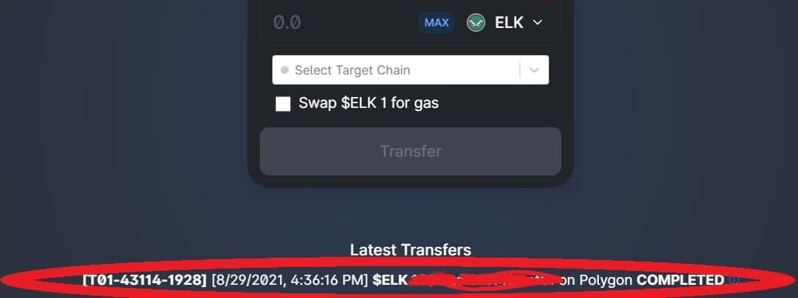

# FAQs

## ElkNet Troubleshooting FAQ

### I sent my token to another chain, and the ElkNet page says it is complete, but I don't see anything!

Please remember that **ElkNet only sends the $ELK Token from one chain to another**. So if you don't see $ELK on the chain you sent to after [adding the other chain to your MetaMask](https://docs.elk.finance/tutorials/metamask), make sure you have added the $ELK Token's Contract Address to MetaMask on each chain so you see it in your wallet. The Contract Address for ELK is the same on every chain:

**$ELK Token:** 0xeEeEEb57642040bE42185f49C52F7E9B38f8eeeE \[[Avalanche](https://snowtrace.io/token/0xeeeeeb57642040be42185f49c52f7e9b38f8eeee)] \[[Polygon](https://polygonscan.com/token/0xeEeEEb57642040bE42185f49C52F7E9B38f8eeeE)] \[[Fantom](https://ftmscan.com/token/0xeEeEEb57642040bE42185f49C52F7E9B38f8eeeE)] \[[Huobi ECO](https://hecoinfo.com/token/0xeEeEEb57642040bE42185f49C52F7E9B38f8eeeE)] \[[Gnosis (formerly xDAI)](https://blockscout.com/xdai/mainnet/token/0xeEeEEb57642040bE42185f49C52F7E9B38f8eeeE/token-transfers)] \[[BNB Chain](https://bscscan.com/token/0xeEeEEb57642040bE42185f49C52F7E9B38f8eeeE)] \[[Kucoin](https://explorer.kcc.io/en/token/0xeeeeeb57642040be42185f49c52f7e9b38f8eeee)] \[[Harmony](https://explorer.harmony.one/address/0xeEeEEb57642040bE42185f49C52F7E9B38f8eeeE)] \[[OEC](https://www.oklink.com/en/okc/address/0xeeeeeb57642040be42185f49c52f7e9b38f8eeee)] \[[HOO](https://hooscan.com/token/0xeEeEEb57642040bE42185f49C52F7E9B38f8eeeE)] \[[Elastos](https://esc.elastos.io/token/0xeEeEEb57642040bE42185f49C52F7E9B38f8eeeE/token-transfers)] \[[Moonriver](https://blockscout.moonriver.moonbeam.network/token/0xeEeEEb57642040bE42185f49C52F7E9B38f8eeeE/token-transfers)] \[[Cronos](https://cronos.org/explorer/token/0xeEeEEb57642040bE42185f49C52F7E9B38f8eeeE/token-transfers)] \[[Telos](https://www.teloscan.io/address/0xeeeeeb57642040be42185f49c52f7e9b38f8eeee)] \[[Fuse](https://explorer.fuse.io/token/0xeEeEEb57642040bE42185f49C52F7E9B38f8eeeE/token-transfers)] \[[IoTeX](https://iotexscout.io/address/0xeEeEEb57642040bE42185f49C52F7E9B38f8eeeE)]

To do this, simply click "Import Tokens" on MetaMask, and then paste the address above into the custom tokens field, MetaMask should autofill the rest of the details.

If this does not work, please ensure your RPC is correct, and try switching it to an alternate one if possible (go to settings in MetaMask > Networks > the chain you are having trouble with, and change the RPC field). A collection of RPCs can be found [here](https://docs.elk.finance/tutorials/metamask) in the docs.

### I've followed the step above and my $ELK appears to be stuck!

Please ensure you have your transaction number from the ElkNet page at [https://app.elk.finance/#/ElkNet](https://app.elk.finance/#/ElkNet), the status of the transaction (Initiated, Processing, or Completed), the chain the transfer it was sent from/to, and how long it has been stuck for. Please provide these details to the [Bridge Support Chat on Telegram](https://t.me/+ypltyHDhtGk1OTMx). The transaction number has been circled in the picture below, and is in the format T00-00000-0000. Transactions will eventually come through.&#x20;

No $ELK has EVER been lost in an ElkNet transfer, and it is 100% safe and all transactions are logged and pending on the blockchain. Problems with congestion, overloaded RPCs, and fluctuating gas prices on popular/high traffic networks delay transfers for the ElkNet. This is out of our control, and we are working to improve functionality daily. If you are stuck, please be patient. The transaction will come through on it's own. Usually transfers are as fast as 7 seconds, but sometimes RPCs get busy and this can take a lot more time! Waiting 30 minutes or so and checking again is always a great strategy.

### The ElkDex is stuck on PENDING after I've initiated a transaction, help!

Not to worry. The UI is sometimes wrong, and may take a lot longer to reflect changes. Go into MetaMask's transaction history and make sure the transaction has gone through there, if it has, just ignore the PENDING message in the UI.

### An admin in the chat messaged me and offered to help, are they legitimate?

No. Admins from Elk Finance will NEVER message you first. If this happens, assume that they are a scammer and not to be trusted. Do not follow any of these instructions, such as "resyncing you wallet".

### The explorer or MetaMask says that the transfer is complete but I don't see the transaction on the other blockhain!

The explorer and MetaMask only indicate that ElkNet has received your $ELK and is sending it to the other chain, not that the whole chain was complete. It still must be burnt on one chain, and sent to your wallet on the other chain. Please reference the transaction number in the example below at [https://app.elk.finance/#/ElkNet](https://app.elk.finance/#/ElkNet), and refresh the page periodically. This will say either Initiated, Processing, or Completed.&#x20;

### I'm on mobile and I can't get anything working at [https://app.elk.finance](https://app.elk.finance)!

Please ensure you are using the browser **in the MetaMask app**, not Safari or Chrome.

## DEx/DApp Troublesooting

### I am trying to stake/unstake/swap and the transaction keeps failing, what do I do?

If you are not receiving ther prompt in MetaMask to confirm the transaction, then please refresh the page. If you are receiving it and it fails immediately, first try switching your RPC to an alternate one if possible (go to settings in MetaMask > Networks > the chain you are having trouble with, and change the RPC field). A collection of RPCs can be found [here](https://docs.elk.finance/tutorials/metamask) in the docs.

If this does not work, please try increasing the gas limit and price. You can do this by hitting "edit" in MetaMask BEFORE submitting the transaction. Then, increase the "gas limit" in the top field by adding a 1 to the first digit (e.g. put 450000 vs 350000) and add 1 to the first digit to the "gas price" on the bottom (e.g., put 6000 vs 5000).

## Other Questions

### **Where Can I Buy a Moose NFT?**

Check [the marketplace in the Moose NFT Section of these docs](https://docs.elk.finance/tokens/moose-nft/marketplaces-for-moose-nfts) to find NFT marketplaces where they are avalilable, or wait until they are for sale for the network of your choice!

### How Do I Farm?

Follow the guide [here](https://docs.elk.finance/tutorials/how-to-farm-with-elk).

### I Only See the Avalanche Chain on the ElkDex. How Can I Use Another Chain?

Elk defaults to Avalanche chain since it was the first chain Elk launched on. To use Matic, for example, just change your network to Matic on your MetaMask and you will see it change to Matic in the ElkDex. If you need to add other chains, try connecting your wallet to [https://chainlist.org/](https://chainlist.org/) and adding additional chains.

### **I Can’t Find My Deposits on the Farm Page.**

If a round of farming just ended, check the [Archived Farms](https://app.elk.finance/#/elk-archive) section on the ElkDex, and see if it shows up there.

### **How Can I Tell How Much My LP is Worth in the Farms?**

You can see your staked pairs on the relevant [Analytics page](https://docs.elk.finance/analytics) and entering your MetaMask (or other wallet) address under the “Accounts” tab. You can also see the fees you’ve earned from staking here.

### **What’s the Maximum Token Supply for $ELK?**

Elk's total supply is 42,424,242. Each chain has an initial allocation of 4,242,242 ELK. To check the current circulating supply, click on your $ELK balance in the [ElkDex](https://app.elk.finance).

### **Can I Send $ELK from chain X to chain Y?**

Yes, with the help of the [ElkNet ](https://app.elk.finance/#/elknet)on the ElkDex. If we are on that chain, you can send/receive $ELK in seconds!

### **The Token I Want Isn’t Appearing in the Swap/Pool Menu.**

If the token is relatively new, it may not be whitelisted yet. Fortunately, you can manually import it into the swap/pool fields by copying and pasting the token address. If you don’t know the address, visit the Analytics page and click on the token. From there, you can either copy the token address, or you can click the ‘trade’ or ‘add liquidity’ buttons at the top. You can also use this token address to add the token to your MetaMask or other crypto wallet.

### Has Elk Finance Been Audited?

**All of our ElkDex smart contracts on** **Avalanche, Polygon, Fantom Opera & Huobi Eco have been successfully audited!**&#x20;

Our HECO ElkDex smart contracts were audited by [HashEx](https://hashex.org) between July 9th to July 20th, 2021. You can find the audit report [here](https://medium.com/hashex-blog/elk-finance-smart-contracts-audit-report-a18deaa5890b). No significant risks were found.

Our Avalanche, Polygon, & Fantom Opera ElkDex smart contracts were also audited by [HashEx](https://hashex.org) between July 24th and July 26th, 2021. You can find the audit report [here](https://medium.com/hashex-blog/elk-finance-smart-contracts-audit-report-5dba57bd71e6). No significant risks were found.

Our ElkNet has not yet been audited. This audit (actually two audits) will probably take place in early Q3. We publish and verify all our code and follow the best practices in terms of security. That said, please remember that most crypto projects are very early and even audited projects are not necessarily safe! Stay safe out there and never invest more than you can afford to lose.

### What is the Difference Between Elk and Traditional Bridges?

The difference between Elk and traditional bridges is best illustrated in several examples. Say the user trades ETH for, let's say, "Anybridge" ETH (a.ETH). Then the bridge has to have enough a.ETH liquidity on the second chain the user is going to (i.e., exit liquidity) so that it can be transferred over. Then, the user has to convert a.ETH back to ETH, and hopefully that is also close in value due to different amounts of liquidity on different chains to ensure a fair exchange price, all the while paying lots of gas, and taking a hit if there is not enough liquidity for ETH on all chains. When traditional bridges introduce chains, more support is required for each additional chain, and not only do they need ETH liquidity, they need it paired with,. say a.ETH, to not take a big hit when selling. Plus with each new chain on a traditional bridge, the "two way bridge" requires a bridge to each new other chain. So if you have AVAX-ETH you have that bridge, but if you introduce BSC and FTM now you need AVAX-BSC, AVAX-ETH, BSC-ETH, AVAX-FTM, FTM-BSC, ETH-FTM, and it gets exponentially more difficult to maintain with each new chain, as it needs to have an individual bridge with every existing chain, as well as maintain enough exit liquidity on each.

So the difference in how the Elk Multi-Bridge works is that $ELK is actually sent across the mainnet (ElkNet). Let's use sending from AVAX and MATIC as an example. $ELK is effectively burnt on AVAX, decreasing the supply and slightly increasing the price of $ELK on that chain, and minting the $ELK on the other chain, slightly increasing the supply and decreasing the price of $ELK on that chain.

The beauty of it is that the market naturally balances the price of ELK across all chains, vs having to manually manage exit liquidity on all chains (like traditional bridges have to do). That's why $ELK is close to the same value across chains, because users can manually arbitrage it for more $ELK using ElkNet and other methods to convert the currency, accumulating more $ELK. Eventually, the plan is to be able to simply be able to swap, say, ETH on it's native chain for, let's say, AVAX on it's native chain, while in the background, behind the scenes the DEx trades ETH for $ELK at the best price on the ETH chain, ElkNet burns ELK on ETH, mints it on the AVAX chain, and swaps the ELK for AVAX at the best price. As we have more $ELK liquidity providers, this will lessen the price impact of even large trades. If there is impact, people will see the difference in price, selling ELK on one chain, and moving the value to the other in order to but more $ELK, which evens things out price wise.

It's also faster than any other bridge. We were seeing times between 7-20 seconds (the slower ones are simply slower because of the network's RPCs), and the gas required is not much. Right now that gas coming out of the ElkNet is completely covered by us, so you don't have to pay for it.

Another thing is that each transfer will permanently burn a very small amount of $ELK from all chains, to ensure sustainability.

Lastly, it is completely decentralized, as only Moose NFT holders can validate transfers across ElkNet (who will get a small amount of $ELK for each validation) only if they are holding a certain amount of $ELK
