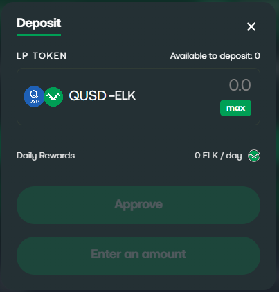

# How to Farm with Elk on Q Blockchain


As with anything in DeFi, farming carries risks such as impermanent loss if the value of any farmed tokens change dramatically. Please take your time to understand these risks before farming and/or swapping tokens.


### How to farm on Q Mainnet

1. Make sure you have a DeFi wallet. We recommend [MetaMask](https://metamask.io) (either the mobile app or the desktop extension for your browser) or other multi-chain compatible wallet such as [TokenPocket](https://www.tokenpocket.pro/en/), Brave Wallet, or Elastos Essentials. Make sure you have the funds you need in your DeFi wallet and are connected to the [desired chain](https://docs.elk.finance/tutorials/metamask) in like so:

2. Head to [ElkDEX](https://app.elk.finance/farms/all), and ensure you are connected to Q Mainnet and verify that they have enough $Q (the native token on Q Mainnet). If not, users can claim a small amount of $Q using the faucet [here.](https://faucet.q.org/)\

3. Decide which tokens you would like to farm. If you already know which farm you want to enter and have equal value amounts of both tokens, skip to step 6. We will be using the $QUSD-$ELK farm in this example.\

4. Once you’ve decided what to farm, you’re going to check to see how many tokens you need. Head to the [Pool Page on the ElkDex](https://app.elk.finance/#/pool/), or select the “Pool” link on the top of the [ElkDEx](https://app.elk.finance/swap) page, and hit "Add Liquidity". When depositing into a liquidity pool, you need to deposit two assets in equal value.\

5. On the [Pool Page](https://app.elk.finance/#/pool/), select the tokens that you would like to farm.


In the example below, we’ve selected $QUSD to farm with $ELK, which would allow us to deposit into the QUSD-ELK farm on the farming page from Step 2. Let’s say we want to farm 1 $QUSD. Typing 1 into the QUSD input field will tell us how many $ELK we must pair it with. In this scenario, I would want to hold at least 10.7526 $ELK for each $QUSD I'd like to farm with.


<figure><picture><source srcset="../../.gitbook/assets/Screenshot 2023-10-16 150148.png" media="(prefers-color-scheme: dark)"></picture><figcaption>
Example LP pairing of $QUSD and $ELK
</figcaption></figure>

6. Once you have this information, it is time to swap your tokens for $ELK/$QUSD on the [ElkDEx](https://app.elk.finance/swap). Users can also send $ELK via ElkNet from any of the other blockchains.


<mark style="color:red;">Pay attention to price impact before swapping tokens.</mark> If the impact is too high, feel free to check the price impact of this swap other DEXs on the chain before swapping and compare it against what you’ll get on the [ElkDEX](https://app.elk.finance/swap). You can find a list of DEXs for most chains at [DefiLlama](https://defillama.com/). If farming an $ELK pair, users can [swap](https://app.elk.finance/swap/43114/AVAX/ELK) for $ELK on other blockchains and use [ElkNet](https://app.elk.finance/elknet) to send the $ELK to $Q Mainnet.


7. Return to the [Pool Page](https://app.elk.finance/#/pool/), select the correct pairing, click "Approve" for both tokens, confirm these transactions in your wallet, and finally hit "Supply" and confirm the transaction in your wallet.\

8. After all of these transactions have succeeded, go to the [Elk Farm Page](https://app.elk.finance/farms) to put your liquidity provider (LP) tokens into the farm, click "Deposit" (or if already in the farm "Manage"), and then click "Deposit", then "Approve" to sign the transaction, and finally selelct "Deposit" and approve that transaction.

<figure><figcaption>
The buttons will be bright green as long as you have deposited the two tokens into the liquidity pool. It will also show you what the estimated daily rewards will be before depositing.
</figcaption></figure>

9. You're finished! Happy farming! You can click the "claim" button accross from "Unclaimed" any time to claim your token rewards for the price of a normal gas fee.&#x20;

<figure><figcaption>
You're all finished!
</figcaption></figure>


If you click "Withdraw" on that page, you will have the option to withdraw your LP tokens from the farm. Keep in mind that you must also remove your LP tokens from the pool to return them to your wallet. If you don't see your pair on the [pool page](https://app.elk.finance/#/pool/), click "[Import it](https://app.elk.finance/#/find)" and manually select the pair to bring up the option to remove some or all of your liquidity from the pool.


