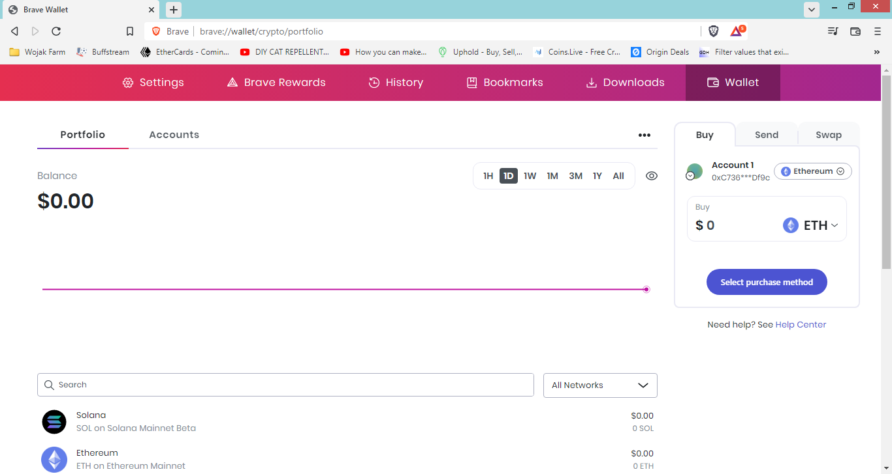

# Brave

## Setting up **Brave**&#x20;

[Brave](https://brave.com/) takes a different approach to their wallet app. It is not an extension of the browser, it is actually built right into the browser. This makes it more secure and it also uses fewer resources since it is built in.

In order to use the Brave Wallet, you have to download and be using the Brave Browser ([https://brave.com/download/](https://brave.com/download/)).\
\
**Quick Steps (For the more experienced, see below for detailed steps)**

1. [Download](https://brave.com/download/) or open Brave browser.
2. Install the wallet (which can be found in the toolbar of the Brave browser).&#x20;
3. After installation, create a password.
4. Back up your seed phrase.

\
**Setting Up Brave Wallet**

**1.** Go to the official Brave website here: [https://brave.com/wallet/](https://brave.com/wallet/). Make sure you use ONLY this link. Any others are a scam.

<figure><figcaption>
Step 1: Go to the official Brave Wallet website. Make sure that you are using the official URL!
</figcaption></figure>

**2.** Once the page loads, right on the main page, you will see a “**Download Brave**” button. Click on it. Then a box will pop up asking where to save the file. Pick a location, and click “Save”.

<figure><figcaption>
Step 2: Download Brave Wallet and save it on your computer.
</figcaption></figure>

**3.** Go to where you saved the file and double-click on it to run the installer. During installation, the program will ask you if you want to import your bookmarks, extensions, & passwords from your old browser. **Click “YES”**.

**4.** Once installation is done click the “Get Started” button. Now it will ask you to create a password, create one. <mark style="color:red;">Make sure you don’t lose this password</mark>. It unlocks your Brave wallet.

<figure><figcaption>
Step 4: Set up a password.
</figcaption></figure>

**5.** Now you will be brought to the “Back up your crypto wallet” screen. This is a **VERY IMPORTANT step. DO NOT SKIP THIS!**

Check the box and click the “Continue” button. Now your 12-word recovery phrase will be revealed. Keep this safe. **If you lose this you cannot recover your wallet, and all of your FUNDS will be GONE!!!**&#x20;

<figure><figcaption>
Step 5: Back up your crypto wallet.
</figcaption></figure>

<mark style="color:red;">**Never share your recovery phrase with absolutely anyone, or they can steal all your funds.**</mark> &#x20;

**6.** After you have backed up your recover phrase, check the box and click on “**Continue**”.  Now you will have to verify your recovery phrase by entering it into the box. Once you are done click the “**Continue**” button.

<figure><figcaption>
Step 6: Verify the recovery phrase that you have just created.
</figcaption></figure>

**7.** You will now be looking at your main wallet dashboard. Congratulations, you have just successfully installed Brave Wallet on your Brave Browser.&#x20;

<figure><figcaption>
You have successfully installed and created a Brave Wallet wallet.
</figcaption></figure>

**8.** Elk Finance supports Brave Wallet and you can connect to the Elk dApp, use our cross-chain ElkNet bridge, provide liquidity, and stake on Elk's platform.&#x20;

By navigating to Elk's DeFi dApp at [app.elk.finance](https://app.elk.finance) and clicking on "**Connect Wallet**" on the top right corner, you can choose "Brave" to connect your Brave Wallet.

<figure><figcaption>
Step 8: Connect your Brave wallet with the Elk dApp.
</figcaption></figure>

