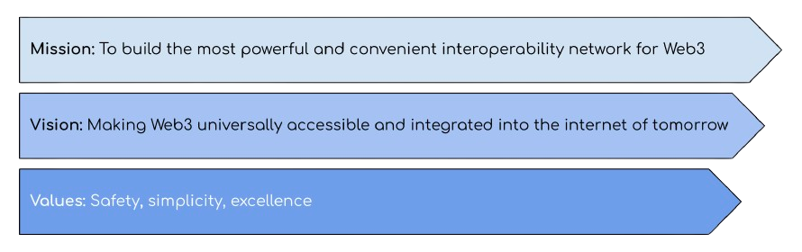

# Timeline and Roadmap

The core goals of Elk determine the direction and development that is needed. This determines the roadmap followed by our engineers.

<figure><figcaption></figcaption></figure>

Therefore, everything that Elk team members are doing is to provide one thing: _A decentralized cross-chain playground that others can use to achieve their Web3 goals._

## The Elk journey so far

1. **Cross-chain transfers**
   1. Cross-chain transfer of ELK token ✅
      1. Limit 100 ELK per transfer ✅
      2. Swap ELK for gas for destination network ✅
      3. Increase limit to 1 000 ELK per transfer ✅
      4. Increase limit to 10 000 ELK per transfer ✅
2. **Elk SDK for developers and platforms to build on Elk (Bridge-as-a-Service - BaaS)**
   1. BaaS Alpha ✅
   2. BaaS SDK Alpha 2 Release ✅
   3. SDK support for permissionless bridge creation (BaaS Beta)
3. **Mainnet node**
   1. Private ElkNet Nodes ✅
   2. Invited users running Elk mainnet nodes
   3. Open applications for ElkNet node running
4. **Staking and delegation**
   1. $ELK staking and delegation for mainnet nodes
5. **Paranodes**
   1. Ability for users to run an Elk paranode (requires Moose NFT)
6. **Proxy tokens**
   1. Support for ERC-20 proxy tokens via BaaS ✅ (Alpha 1)
   2. Improved support for arbitrary data transfer (universal bridge) via BaaS ✅ (Alpha 2)
7. **Multi-chain tokens**
   1. Initial support for multi-chain tokens (BaaS) ✅ (Alpha 2)
8. **ElkDex**
   1. Based on Uniswap v2 ✅
   2. Based on Uniswap v3 ✅ (Testnet)
9. **Farm-as-a-Service (FaaS)**
   1. FaaS for v2 ✅
   2. Fees payable in ELK ✅
10. **Blockchain support expansion** ✅ (30 blockchains added)

## Usability

1. Redesigned dApp ✅
2. Redesigned website ✅
   1. Native Blog ✅
   2. Documentation update ✅
3. Integration into wallets ✅

## Roadmap 2024

For the coming year we have identified the following elements to achieve:

#### 2024 Q1/2:

* Bridging-as-a-Service Software Development Kit (SDK) Beta release
* Xion payments solution roll-out and scaling
* Further developer exploration and engineering consultation for various cross-chain applications
* FaaS for ElkDex concentrated liquidity farms (based on Uniswap v3)

#### 2024 Q3 onwards:

* Mainnet Nodes - Securing ElkNet by staking ELK
* Cross-Chain Swaps - One-click asset trading through the ElkDex, powered by ElkNet
* Security audits of the ElkNet
* Elk Launch on non-EVM Chains
* Community Governance
* Continuous Chain Expansion
* CHFT Cross-chain Stablecoin, Pegged to the Swiss Franc

\* Note that there are no dates in the roadmap and specified target development is subject to change.
