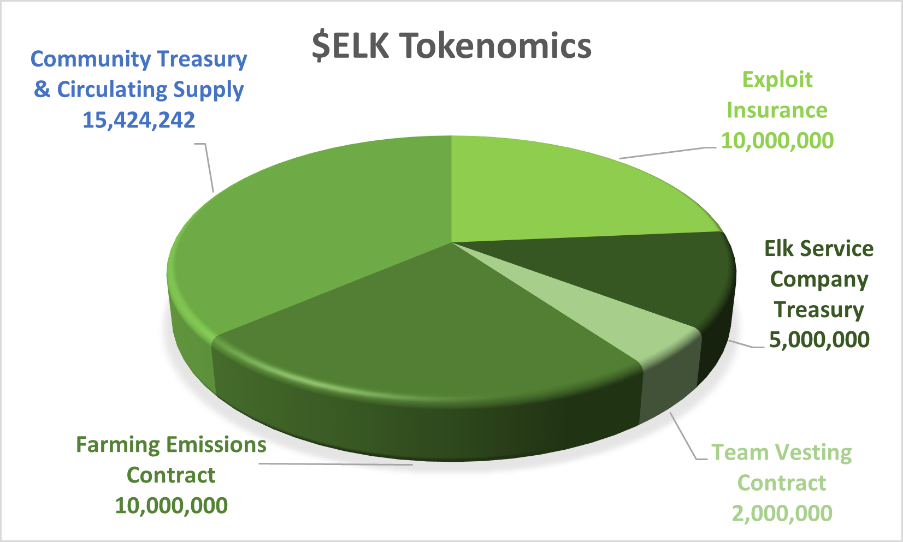

# Whitepaper

## Abstract

With the emergence of many networks for decentralized finance (DeFi), including blockchains, layered solutions, optimistic rollups, Avalanche subnets, and Polygon supernets, the entire DeFi landscape is more disconnected than ever before. The future is about choice, and the presence of many blockchains provides greater flexibility to choose.

Traditional cross-chain bridges connect these fragmented ecosystems, but are the weak point of DeFi as a whole. Regrettably, bridge exploits account for billions of dollars in stolen assets. Unsecure bridges are the largest problem area for decentralized cryptocurrencies, accounting for half of all stolen funds in DeFi since 2020.

Elk Finance connects the many ecosystems within DeFi. Elk develops blockchain interoperability infrastructure that enables value and data transfers across blockchain domains, for end-users and partner projects utilizing our technology. Our flagship product, ElkNet, enables secure seamless multi-chain operations for new and existing cryptocurrencies and blockchain projects (e.g., DeFi lending, GameFi, SocialFi, NFTs, etc.), with plans to connect all types of EVM and non-EVM blockchain networks.

## Contents

* Introduction
* Background and Motivation
* Design Goals and Principles

## Introduction

The future of decentralized finance (DeFi) is certainly “multi-chain”. A growing number of blockchains have been developed over the last several years, all with a variety of functions, decentralized applications (dApps), userbase, and architecture. While the innovation created by this expansion is undoubtedly inevitable and exciting, it comes with its own host of challenges. Arguably, the largest and most difficult of these challenges to be addressed is the transfer of value and information between chains.

Traditional oracles are part of this solution, and bridging allows the users to move value between the various blockchains and subnets. There are a variety of bridging solutions available, but these solutions have proven vulnerable to security risks, resulting in billions of dollars of lost assets and revenue (Wenkai, et al., 2022). Value transfer, cross-chain communication, and secure bridging, are problems that Elk Finance is solving with ElkNet.

Simply put, Elk Finance aims to connect the many new and existing blockchains in Web3. ElkNet will allow users to explore the many products and services present in DeFi without the use of a centralized entity (e.g., centralized exchanges, centralized bridging solutions). Users and creators alike will be able to use ElkNet v3’s decentralized infrastructure to transfer any token to multiple platforms securely, transfer value across blockchains, and implement dApps with customized cross-chain functionality.

## Elk's Cross-Chain Solution

ElkNet v2 vs Traditional Bridges:

<figure><figcaption>
How ElkNet Outperforms Traditional Bridges
</figcaption></figure>

ElkNet's reservoirs increase transparency, eliminate custodial risk, and reduce smart contract vulnerabilities, all at once. The reservoir contracts allow any party to query the blockchain or check the relevant explorer to see the balance of the reservoirs on all networks. Since there are no bridge tokens locked on either end, individual users are not trusting a custodial bridge operator to secure their funds. Lastly, smart contract vulnerabilities such as double spends are impossible with ElkNet, as any given cross-chain transfer passes through both the Bifrost and reservoir contracts on both the origin and destination chain.

The reservoir and Bifrost reduce overhead by delegating multiple smart contract interactions to the generic messaging layer. By pre-minting the total supply of ELK on each chain, we’ve removed the risk of minting exploits, which are one of the primary security risks of traditional cross-chain bridges.

ElkNet v3 will be decentralized and trustless, requiring validators to stake ELK in order to run ElkNet nodes. These nodes will monitor the origin and destination blockchains using multiple RPCs, requiring consensus for the completion of cross-chain interactions.

**Current Solutions Do Not Scale**

Most current bridging solutions are unable to scale. Bridges often fall into two categories: lock-and-release and lock-and-mint. Lock-and-release bridges rely on an existing token to be present in a pool on each blockchain the bridge is connected to. Lock-and-mint bridges use a mint function to mint tokens on a destination blockchain after tokens are sent to a pool on the origin blockchain.

As the demand for secure and efficient bridging solutions increases, more and more locked tokens are required for each of these solutions. This means that the project maintaining these bridges must have a large amount of tokens available in the pool so that users may receive these tokens following a cross-chain transfer.

To illustrate this using an example, imagine a lock/mint bridge that moves USDC from blockchain X to blockchain Y. There are 10,000 USDC locked on blockchain X. The user transfers 200 USDC to the bridge’s smart contract on blockchain X, with a message indicating that they want the same amount of USDC (less fees) on blockchain Y. There is now 10200 USDC in the blockchain X pool. The bridge mints 200 USDC.X on blockchain Y. The user receives the USDC.X, and proceeds to spend it on a new protocol on chain Y, along with many other users. These users make large gains worth 15,000 USDC.X and decide to transfer their profits back to chain X using the bridge. The first several users transfer a total of 10,200 USDC.X on chain Y to redeem USDC on chain X. This leaves no USDC in the pool on chain X. Users must now wait until more users transfer from chain X to chain Y, refilling the USDC pool, or for the bridging protocol to purchase/borrow more USDC on chain X so they may exit.

In addition to this drawback, USDC.X must be collateralized on chain Y in order to have the same value as it does on chain X. Not only does the creation of USDC.X allow for fragmentation, being that a new token may have to be minted for each new blockchain connected (e.g.,USDC.Z on chain Y when bridged from chain Z, USDC.A on chain Y when bridged from chain.A, etc), it also creates confusion for the end user.

These solutions are also centralized, with no plans to become decentralized. The user must rely on the bridge protocol to minimize smart-contract vulnerabilities with each new contract on each new chain, maintain liquidity for their minted tokens, refill and rebalance pools, and trust them to manage the large sums of value in their pools. The above solutions require the user to trust the project that has created and manages the bridge.

## Design Goals and Principles

Glossary:

ElkNet: Elk Finance’s cross-chain bridge

Elk SDK: The software development kit for Elk Finance’s Bridging-as-a-Service (BaaS)

Proxy token: A token created with our SDK - native to the ElkNet

Node: ElkNet validator, secured with ELK and responsible for signing cross-chain transactions

Reservoir: A flexible smart contract containing proxy tokens

#### Security

ElkNet is a safe method of moving value across blockchains. ElkNet minimizes common bridging risks (unsecure security for token pools for entry and exit, double spends, 51% attacks, etc.) The system introduces optimistic delays and periodic verification of transfer messages to detect inconsistencies in the blockchain (e.g., reorganization) or suspicious activities, preventing further processing of such transfers.

#### Low Cost

ElkNet is carefully gas-optimized and requires only two on-chain transactions per cross-chain transfer, minimizing gas costs for all parties: users and operators.

#### Fast

ElkNet is as fast as the underlying blockchains it supports. In most cases, transactions go through in mere minutes. The transfer is completed after finality is confirmed on the source chain. The transfer speed between two chains is unaffected by other chains or congestion.

#### Compatibility

Its unique design allows ElkNet to be compatible with all blockchains, whether they are EVM or otherwise. Our Bridging-as-a-Service (BaaS) design enables builders to reap the benefits of any chain ElkNet is connected to, as the project can easily port its tokens to EVM and non-EVM blockchains. ElkNet also plays nice with other bridging solutions, and is very modular, so you don't need to commit to just one bridging solution.

#### Decentralized

ElkNet will be secured by a set of decentralized nodes that collectively verify messages and transfers, and work together to post transactions on the relevant blockchains. The decentralized nature of the system also helps provide censorship-resistance and long-term viability.

#### Transparency

Using a reservoir system allows users/projects to follow transactions on and off-chain, and ensures a simple but adaptable mechanism for bridging. Transfers are easily executed by users, where the only interactions are with ElkNet, the origin blockchain, and destination blockchain the user is bridging between.

#### Customizability

Applications and bridges built on top of ElkNet can customize their bridging interface using our BaaS SDK. The liquidity for any proxy token can be present on any decentralized exchange (DEX), allowing the interface to direct the user wherever they like.

#### Unique Features

Features such as the “swap for gas” option, allow users to arrive on-chain with the ability to instantly interact with the chain’s ecosystem. Cross-chain messaging allows ElkNet to communicate with any blockchain it is connected to. ElkNet is the hub of the ecosystem and ensures that transfers from/to all chains are handled without issue.

#### Minimal Maintenance

Since the ElkNet is becoming an independent network operated by decentralized nodes, developers building on top of ElkNet need not maintain their own nodes. Similarly, ElkNet supports easy cross-chain price arbitrage, allowing prices to stay consistent on all blockchains when deploying a custom ElkNet-powered bridge.

## Elk Platform

### ElkDex & Farms

The ElkDex is a decentralized exchange (DEX) deployed on all ELkNet-supported blockchains and allows for swapping of various assets on-chain using liquidity pools. The DEX is a Uniswap-compatible automated market maker (AMM) supporting the creation and management of liquidity pools, farming, staking, and an easy-to-understand user interface for bridging with the ElkNet. ElkDex can be accessed at[ app.elk.finance](https://app.elk.finance).

#### Yield Farming

Our community has the opportunity to participate in yield farming by providing liquidity pairs to bootstrap the Elk ecosystems on various blockchains and locking these pairs in the Elk Finance farming smart-contracts. These contracts have the ability to reward both ELK and a second "booster token" that may be changed out during the farming review every 42 days.

#### Farming-as-a-Service

Elk Finance has created Farming-as-a-Service (FaaS) smart-contracts that are available for any project to utilize. These farms can be accessed on a specific FaaS page on the Elk dApp, and projects may also create a custom front-end for these farms on their own dApp. Farming features available in Elk Finance’s yield farming are available with FaaS too (booster token rewards, etc.)

### ElkNet

The ElkNet is the hub of the Elk Finance Ecosystem, allowing communication and value transfer between supported blockchains. The development of ElkNet will include support for application blockchains, subnets, supernets, etc. with different virtual machines. The current version of ElkNet, ElkNet v2, introduces a unique reservoir system for moving value cross-chain. Paired with the BaaS Elk SDK, it will be possible for any project to utilize ElkNet to create a secure custom cross-chain bridge.

Each Reservoir Contract holds in reserve the total supply of ELK tokens (\~42 million) minus the circulating supply on the corresponding chain. The ElkNet controls and coordinates movements of ELK tokens into and out of these reservoirs. For cross-chain transfers, ELK tokens enter the reservoirs on the origin chain, prompting ElkNet to send a message to the reservoir on the destination chain to release ELK into the user’s wallet.

The reservoir system has multiple design and security advantages over the two prevailing methods for cross-chain bridging: burn-and-mint and lock-and-release.

### Cross-chain Stablecoin

In order to facilitate cross-chain value transfers and payments with minimal risk, Elk Finance plans to release a stablecoin called CHFT. Upon release, CHFT will be the first cross-chain stablecoin natively present on all of the chains ElkNet is connected to. As an ERC20 standard, CHFT will be freely tradeable on supported exchanges. The stablecoin will be fully compatible with Ethereum wallets and compatible wallets on supported chains. CHFT will be backed by a variety of blue-chip assets, including ELK.

### Cross-chain Swaps

Elk Finance aims to support rapid cross-chain swaps of various tokens. Combining a state-of-the-art liquidity pooling system with a decentralized peer-to-peer network makes fast, trustless, and cheap swaps possible between tokens on different blockchains. Value transfer across blockchains, subnets, supernets, and other types of networks will play a large role in the adoption of cryptocurrencies over the coming years. Current solutions to the cross-chain interoperability problem are slow and expensive - Elk Finance will change that.

### Elk’s Bridging-as-a-Service SDK & Possible Applications

Using the BaaS SDK, developers will easily be able to deploy a custom secure cross-chain bridge. Using ElkNet allows them to integrate cross-chain functionality into their Web3 applications. In order to utilize the ElkNet bridge for a single token, developers must lock an Elk Finance Moose NFT, along with a number of ELK tokens on the desired blockchains they wish to bridge to.

During this process, the developer will create a "proxy token" on any destination network. A proxy token is a version of a token that is present on another blockchain, differing slightly from "wrapped tokens". Taking advantage of ElkNet's reservoir system (or a mint-burn system, if preferred) on all networks, developers can utilize the ElkNet and the SDK to deploy a custom secure cross-chain bridge. So long as liquidity is paired with the proxy token on the destination network(s), users will be able to bridge these tokens and use them to interact with various decentralized applications in multiple ecosystems.

## Governance and the ELK Token

The ELK token is an ERC20-compatible utility token that underpins the Elk Finance ecosystem. Central to the design of the Elk Finance ecosystem is the fact that all liquidity pools are created with ELK. This design decision allows for sub-second transfer of value across chains and provides deeper liquidity for pools, reducing slippage and fees. ELK also doubles as the governance token for the Elk Finance Ecosystem. The ELK token will be purchased with a portion of fees obtained from all ElkNet usage.

### Tokenomics

The figure below shows the current distribution of ELK Tokens

* 10M ELK: allocated to an Exploit Insurance contract
* 5M ELK: allocated to an Elk Service Company Treasury contract
* 2M ELK: allocated to a Team Vesting contract
* 10M ELK: allocated to a Farming Emissions Contract contract
* The remaining ELK is split between the circulating supply and the Community Treasury contract

<figure><figcaption>
ELK Tokenomics
</figcaption></figure>

### Exploit Insurance Contract 

This contract stores **10M $ELK** to be used for insurance against any unforeseen exploits of the ElkNet. It is subject to Elk governance. The proposed reserve is equivalent to more than 3 days of transfers based on current daily ElkNet transfers limits per chain (this assumes that a malicious exploit would be discovered in three days). In the event of a double-spend attack, ELK will be burned from this fund to ensure that the circulation of ELK never reaches more than 42M. In the event of attacks involving other tokens interacting with ElkNet, these funds can cover the losses incurred by third parties.

### Elk Service Company Treasury 

This treasury contract is controlled by the Elk Service Company multi-sig. The contract releases a maximum of 10k ELK per week up to a total of **5M ELK**. These funds are intended to cover the development and operating expenses of the Elk Service Company in promoting the growth of Elk. Claims will not begin until the Elk Service Company becomes an incorporated entity.

### Team Vesting Contract 

This contract releases a maximum of 1k ELK per day up to a maximum of **2M ELK**. These funds can be claimed without restriction by the developers, per the original litepaper, and are used for team compensation and regular operating expenses. Neither the Elk Service Company nor the Elk governance has oversight over the use of the funds.

### Farming Emissions Contract 

A unified contract storing emissions reserves until farming ends. This contract holds the emissions to be released according to the determined schedule. The team maintains responsibility for allocating emissions to the farms in the best interest of the project until the establishment of a full fledged governance body.

### Community Treasury 

The Community Treasury will be controlled by Elk governance. The contract will place a hard cap of **2M ELK** to be spent by governance per year on proposals achieving a simple voting majority once governance is fully implemented.

#### ELK Distribution

Elk Finance will distribute the 10 million liquidity provisioning tokens over the years to liquidity providers with halving every year according to the following schedule:

* 1st year: 5 million ELK tokens distributed. (Complete)
* 2nd year: 2.5 million ELK tokens distributed.
* 3rd year: 1.25 million ELK tokens distributed.
* 4th year: 0.625 million ELK tokens distributed.
* ...

## Discussion

### Future Improvements

#### Decentralization and Nodes

ElkNet v3 will be completely decentralized. Validators will operate ElkNet nodes which require the staking of ELK in order to run ElkNet nodes. These nodes will monitor the origin and destination blockchains using multiple RPCs, requiring consensus for each cross-chain transaction involving ElkNet.

These nodes will not be hardware intensive, and require only a low to medium tier hardware to run reliably. At first, only whitelisted wallets will be able to run nodes. When the number of validators increases, and the nodes are operating reliably, Elk Finance will remove the whitelisting requirement. At this point, anyone will be able to run a node after setting up their hardware and staking the required amount of ELK.

The formula for the amount of ELK required for optimal network security and reliability is as follows:

Number of ELK to Stake per Validator = Circulating Supply / Number of Nodes Required

Elk Finance aims to have 50 validators for ElkNet to ensure decentralization. Assuming a circulating supply of 13 million ELK when ElkNet v3 releases, this means that each validator will have to stake approximately 260,000 ELK. Multiple users will be allowed to pool their ELK together using the node staking contract in order to run a single node.

#### Non-EVM Support

ElkNet is able to interact with all blockchains, whether they are based on the Ethereum Virtual Machine (EVM) architecture or not. ElkNet can provide a custom full-featured bridging and cross-chain messaging infrastructure on any blockchain so long as the chain allows the creation of smart contracts with multiple diverse RPC endpoints. Non-EVM chain compatibility will be added after the beta release of ElkNet v3.

### Concerns

#### Denial of Service Attacks

Elk Finance’s domain is protected by CloudFare and has many security measures in place, protecting it from malicious attacks. It is not possible to protect from everything, so a decentralized version of the Elk Finance dApp will be created on IFPS in order to provide an alternative to the currently hosted dApp.

#### Competition

There are many projects working on novel bridging solutions in DeFi. Elk Finance aims to collaborate with other projects when possible, as innovation is stifled when projects work independently. The ElkNet SDK will allow for the integration of pre-existing solutions, as well as many novel ones. Projects are encouraged to reach out to Elk Finance if interested in collaborating. We believe that multi-chain interoperability is the current “Holy Grail” of DeFi, and that there will be a variety of competing products that address it. ElkNet offers a secure, efficient, customizable, and decentralized solution.

#### 51% Attacks

ElkNet has out-of-the-box protections when it comes to 51% attacks on any blockchain it is connected to. Operations will not be processed when inconsistent data is detected between RPCs connected to the same blockchain. Often this indicates that this type of attack is taking place on a chain.

## Conclusions

The future certainly involves multiple blockchains, as foreshadowed by the plethora of blockchain options available in DeFi, and the increasing volume moving between these solutions6. Centralized bridges are the norm in the current DeFi landscape, coming with their own set of challenges, as they are responsible for the majority of stolen funds.

Demand remains for secure, trustless, customizable, efficient, and cost-effective solutions to multi-chain interoperability. Elk Finance provides this solution with ElkNet, creating the infrastructure allowing any project to become cross-chain. Elk Finance aims to be a one-stop-shop for cross-chain transactions, trading, farming, and custom infrastructure for both customers and businesses alike.

## Notes and Further Reading

[Elk Finance Documentation](https://docs.elk.finance/)

[ElkNet BaaS Documentation](https://docs.elk.finance/for-developers/bridge-as-a-service-baas)

## References

1Li, W., Bu, J., Li, X., & Xianyi, C. (2022). Security Analysis of DeFi: Vulnerabilities, Attacks and Advances. arXiv, https://arxiv.org/pdf/2205.09524.pdf\
[https://www.bloomberg.com/news/articles/2022-06-24/crypto-bridge-horizon-is-hacked-for-100-million](https://www.bloomberg.com/news/articles/2022-06-24/crypto-bridge-horizon-is-hacked-for-100-million);\
[https://www.wired.com/story/blockchain-network-bridge-hacks/](https://www.wired.com/story/blockchain-network-bridge-hacks/); [https://www.bloomberg.com/news/articles/2022-03-30/crypto-bridge-hacks-reach-over-1-billion-in-little-over-a-year#xj4y7vzkg](https://www.bloomberg.com/news/articles/2022-03-30/crypto-bridge-hacks-reach-over-1-billion-in-little-over-a-year#xj4y7vzkg).\
[https://cointelegraph.com/news/report-half-of-all-defi-exploits-are-cross-bridge-hacks\
](https://cointelegraph.com/news/report-half-of-all-defi-exploits-are-cross-bridge-hacks)[https://debridges.com/](https://debridges.com/)&#x20;

